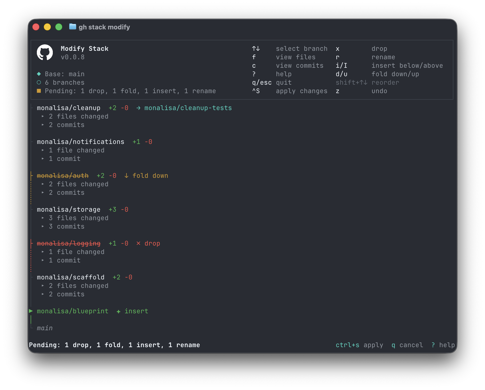

`gh stack modify` provides an interactive terminal UI for restructuring a stack locally. You can drop, fold, insert, rename, and reorder branches and then apply all your changes at once.



## When to use modify

Use `modify` when you need to:
- **Remove** a branch from the stack
- **Combine** two branches into one
- **Insert** a new branch into the stack
- **Rename** a branch
- **Reorder** branches

## Prerequisites

Before running `modify`, ensure:
- You have an active stack checked out locally
- Your working tree is clean (no uncommitted changes)
- No rebase is in progress
- No PR in the stack is queued for merge
- Commit history is linear (run `gh stack rebase` first if needed)
- Git 2.36 or later
- Worktrees needed by the staged actions and surviving cascade are clean and have no other Git operation in progress

Branches may be distributed across worktrees. Before applying, modify checks the owners needed by the selected actions and the surviving cascade. It checks again immediately before a mutation; it never auto-stashes. Unrelated worktrees, merged branches, and dropped/folded sources that are only read are left untouched. Trunk is only read, so its ownership alone does not block modify.

Separate Git administration directories support a known main or linked modify origin. Main-owner discovery also supports existing absolute/relative `core.worktree` backlinks, including the main `config.worktree`. The discovery caveat is only linked invocation without a main-worktree backlink; unaffected worktrees remain usable. See [Separate Git administration directories](/gh-stack/guides/workflows/#separate-git-administration-directories).

## Opening the TUI

```sh
gh stack modify
```

The TUI shows your stack as a vertical list of branches with PR information, commits, and files changed. Merged branches appear as locked rows that cannot be modified. Press `?` for a help overlay describing all operations.

## Operations

### Drop (`x`)

Removes a branch and its commits from the stack. The local branch, its worktree, and any associated PR are preserved. Branches above it are rebased in their owning worktrees to exclude the dropped branch's unique commits.

### Fold down (`d`)

Absorbs the selected branch's commits into the surviving branch below it (toward trunk) via cherry-pick in that receiver's worktree. The folded branch is removed from the stack, but its underlying ref and worktree remain intact.

### Fold up (`u`)

Absorbs the selected branch's commits into the surviving branch above it (away from trunk). Since that branch already contains the source's commits, modify adjusts its original-parent cutoff so its rebase includes both layers. The source is removed from stack membership only; its ref and worktree are preserved.

### Insert below / above (`i` / `I`)

Inserts a new empty branch into the stack at the cursor position. Lowercase `i` inserts below the cursor (toward trunk); uppercase `I` inserts above the cursor (away from trunk). An inline prompt appears to enter the new branch name. The branch ref is created at apply time, pointing at its parent's tip; no worktree is created.

### Rename (`r`)

Opens an inline prompt to enter a new name for the branch. The branch is renamed in its owning worktree and in stack metadata, without moving the worktree directory or switching it to unrelated history. On the next `submit`, the new branch name is pushed to GitHub.

### Reorder (`Shift+↓`/`Shift+↑`)

Moves the selected branch down (toward trunk) or up (away from trunk) in the stack. A cascading rebase adjusts branches in their existing owners; unoccupied branches are processed in the initiating worktree. Note: reordering and structural changes (drop/fold/insert/rename) cannot be mixed in the same session.

### Undo (`z`)

Reverses the most recent staged action. You can undo multiple times to step back through your changes.

## Applying changes

Press `Ctrl+S` to apply all staged changes. Nothing is modified until you save. The apply phase renames branches, inserts new branches, folds/drops branches, and runs a cascading rebase to create a linear commit history with the desired stack state.

Other worktrees retain their branch choices throughout the operation. The initiating worktree returns to its original branch, using the new name if renamed. If that layer was folded, modify selects the branch that received its commits, even across dropped layers or a receiver rename. If it was dropped, modify selects the nearest surviving branch. This changes the initiating checkout only if the selected branch is available here; otherwise it keeps the preserved original branch and reports the survivor's owning path instead. No worktrees are created, removed, or detached.

### Handling conflicts

If a rebase conflict occurs during the apply phase, you have two options:

1. **Resolve and continue**: Fix the conflicts in your editor, stage with `git add`, then run `gh stack modify --continue` (you may need to do this multiple times)
2. **Abort**: Run `gh stack modify --abort` to abort the operation and restore the stack to the pre-modify state

If a second conflict occurs after continuing, the same options are available. A fold-down cherry-pick can be followed by a rebase conflict in a different worktree; follow the newly reported path each time. Remaining structural actions are checkpointed and resumed, not skipped or repeated.

The conflict message identifies the **worktree with the active Git operation**, which may differ from the origin or the fold source. Edit and stage files there. You can invoke `--continue` or `--abort` from any linked worktree; native operations use their recorded owners rather than the caller's checkout. Other target worktrees are checked before continuing; remaining branches in the intentionally busy conflict worktree are checked after the native operation finishes.

If Git's recorded rebase or cherry-pick is no longer in progress, for example after an external `git rebase --abort`, `modify --continue` refuses and preserves the journal. Use `gh stack modify --abort` to recover through the saved state; continuation will not claim a new branch tip as completed modify work.

## After modifying

If a stack of PRs has been created on GitHub, run:

```sh
gh stack submit
```

This pushes the updated branches and updates their pull requests. With two or more PRs, the old stack is replaced; a single remaining PR is submitted without creating a new stack object.

The pending-modify journal is cleared only after all required PR submissions and updates succeed and the local catalog is saved. Failed updates or deselected branches without PRs leave it pending so you can complete the submission with `gh stack submit`.

## Aborting

If you want to discard all changes and restore the stack to its pre-modify state, run:

```sh
gh stack modify --abort
```

This also works if `modify` was interrupted (e.g., terminal crash). The shared `<common-dir>/gh-stack-modify-state` journal records the origin, participating owners, original checkout, stack identity, action progress, and expected refs before/after mutations. Native rebase/cherry-pick state remains in the worktree running that Git operation.

Recovery reverses renames in their owners, restores only operation-touched refs, removes only branch refs proven to have been created by this modify, and restores the origin's original checkout. It never deletes a worktree or resets a preserved drop/fold source just because that source is in the snapshot. If an owner is missing, refs or ownership changed externally, or a restore/save fails, recovery stops and retains its journal instead of reporting success. Address the reported problem and retry `--abort`; do not delete the journal to bypass recovery. After a successful modify has reached pending-submit, `--abort` does not undo it and instead directs you to `submit`.

Clone-wide mutation serialization prevents another gh-stack mutation while modify is applying or paused; read-only views remain available. Pending-submit state is consumed only when submitting its matching stack, never an unrelated stack.

The mutation lock coordinates gh-stack processes only: arbitrary Git commands, editors, and other tools can still change refs or files. Keep affected worktrees idle during history rewrites. While paused, make only the requested conflict-resolution edits and staging in the reported worktree; do not add unrelated commits to branches that have not yet been processed.

Legacy journals must be continued or aborted in their original worktree before catalog migration. Nonconflicting legacy catalogs are consolidated with originals preserved; conflicts require reconciliation rather than choosing a definition automatically.

## Limitations

- Cannot modify merged branches (they are locked)
- Cannot split a branch into multiple branches
- Cannot move branches between different stacks
- Requires an interactive terminal
- Reordering and structural changes (drop/fold/insert/rename) cannot be mixed in the same session
